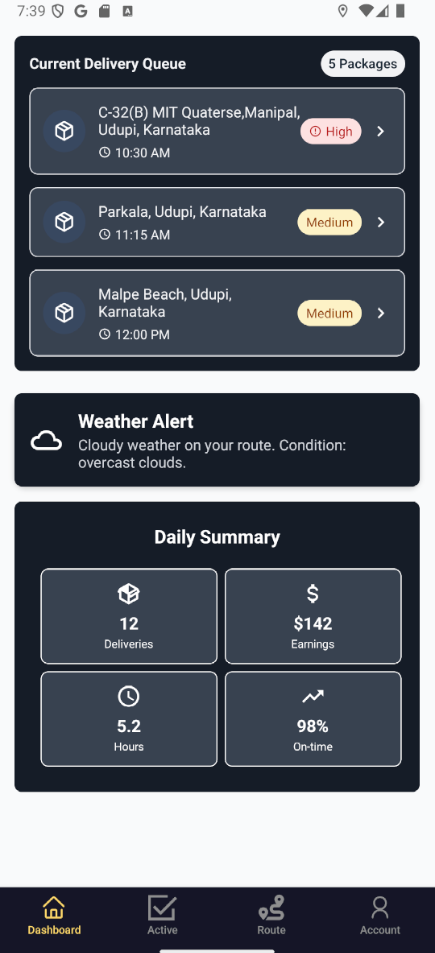
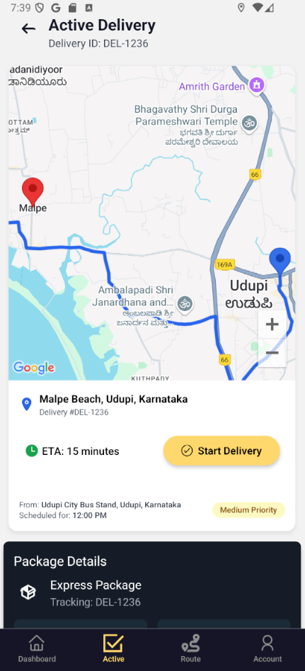
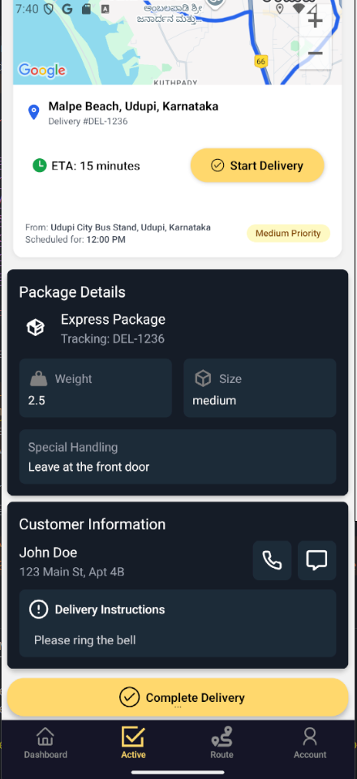
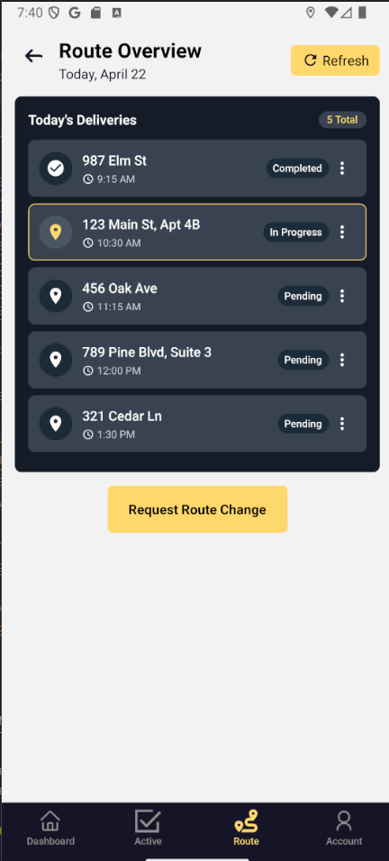
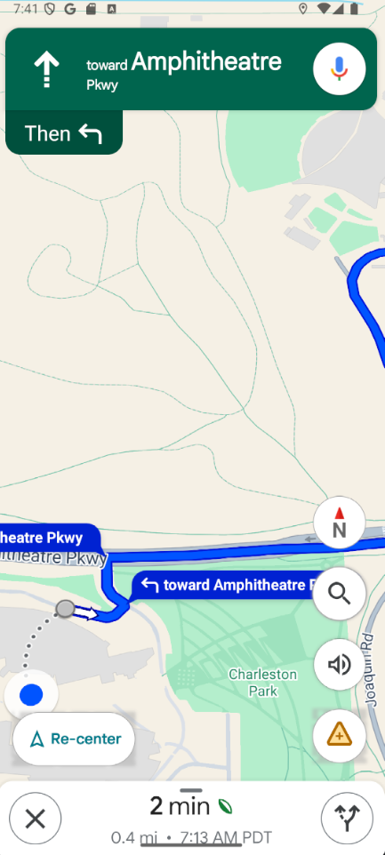
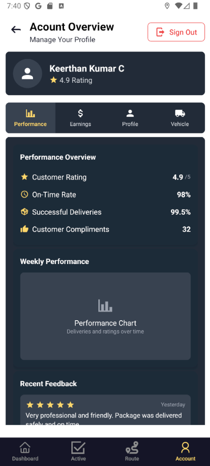

# MargaDarshi Driver App

A React Native delivery driver application built with Expo, featuring real-time location tracking, delivery management, and push notifications.

## 📱 Features

- **Real-time Location Tracking**: GPS-based location services for delivery tracking
- **Delivery Management**: View active deliveries, customer information, and delivery details
- **Push Notifications**: Real-time notifications for new delivery assignments
- **Interactive Maps**: Google Maps integration for navigation and route optimization
- **Weather Integration**: OpenWeatherMaps API for weather-aware deliveries
- **Modern UI**: Built with NativeWind (Tailwind CSS) and React Native Paper

## Screenshots








## 🛠️ Tech Stack

- **Framework**: React Native with Expo
- **Navigation**: Expo Router with file-based routing
- **Styling**: NativeWind (Tailwind CSS for React Native)
- **UI Components**: React Native Paper
- **Maps**: Google Maps API
- **Weather**: OpenWeatherMaps API
- **Language**: TypeScript
- **State Management**: React Context API

## 🚀 Getting Started

### Prerequisites

- Node.js (v14 or later)
- npm or yarn
- Expo CLI
- Android Studio (for Android development)
- Xcode (for iOS development, macOS only)

### Installation

1. **Clone the repository**

   ```bash
   git clone <repository-url>
   cd driver_rn_app
   ```

2. **Install dependencies**

   ```bash
   npm install
   ```

3. **Set up environment variables**

   Create a `.env` file in the root directory:

   ```env
   GOOGLE_MAPS_API_KEY=your_google_maps_api_key
   OPENWEATHERMAPS_API_KEY=your_openweather_api_key
   ```

4. **Start the development server**

   ```bash
   npx expo start
   ```

5. **Run on device/emulator**
   - Press `a` for Android emulator
   - Press `i` for iOS simulator
   - Scan QR code with Expo Go app for physical device

## 📁 Project Structure

``` bash
driver_rn_app/
├── app/                    # Expo Router pages
│   ├── (tabs)/            # Tab-based navigation
│   │   └── active/        # Active delivery screens
│   ├── auth/              # Authentication screens
│   └── _layout.tsx        # Root layout
├── components/            # Reusable components
│   ├── Screens/          # Screen components
│   └── ui/               # UI components
├── context/              # React Context providers
├── Lib/                  # Utility libraries and services
├── assets/               # Images, fonts, and static files
├── android/              # Android-specific configuration
└── new/                  # Development files
```

## 🔧 Configuration

### Google Maps Setup

1. Get a Google Maps API key from [Google Cloud Console](https://console.cloud.google.com/)
2. Enable the following APIs:
   - Maps SDK for Android/iOS
   - Geocoding API
   - Directions API
3. Add the API key to your `.env` file

### Push Notifications

The app is configured for push notifications with the following permissions:

- `POST_NOTIFICATIONS` (Android)
- Background location access for delivery tracking

### Location Services

Required permissions:

- `ACCESS_FINE_LOCATION`
- `ACCESS_COARSE_LOCATION`
- `ACCESS_BACKGROUND_LOCATION`
- `FOREGROUND_SERVICE`

## 📱 Key Screens

- **Dashboard**: Overview of delivery statistics and driver status
- **Active Deliveries**: List and details of current delivery assignments
- **Delivery Details**: Customer info, delivery location, and navigation
- **Authentication**: Driver login and registration

## 🎨 Styling

The app uses NativeWind for styling, which brings Tailwind CSS utility classes to React Native:

```tsx
<View className="flex-1 bg-gray-50 p-4">
  <Text className="text-2xl font-bold text-gray-900">Dashboard</Text>
</View>
```

## 🔄 Development Scripts

```bash
# Start development server
npm start

# Build for production
npm run build

# Run linting
npm run lint

# Format code
npm run format

# Reset project (move to app-example)
npm run reset-project
```

## 📦 Building for Production

### Android

```bash
expo build:android
```

### iOS

```bash
expo build:ios
```

## 🚀 Deployment

The app can be deployed using:

- **Expo Application Services (EAS)** for managed workflow
- **Manual builds** for bare workflow
- **App Store Connect** (iOS) and **Google Play Console** (Android)

## 🤝 Contributing

1. Fork the repository
2. Create a feature branch (`git checkout -b feature/amazing-feature`)
3. Commit your changes (`git commit -m 'Add amazing feature'`)
4. Push to the branch (`git push origin feature/amazing-feature`)
5. Open a Pull Request

## 🆘 Support

For support and questions:

- Create an issue on GitHub
- Contact the development team
- Check the [Expo documentation](https://docs.expo.dev/)

## 🔗 Related Resources

- [Expo Documentation](https://docs.expo.dev/)
- [React Native Paper](https://reactnativepaper.com/)
- [NativeWind Documentation](https://www.nativewind.dev/)
- [Google Maps Platform](https://developers.google.com/maps)
